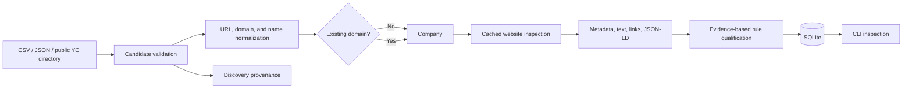

# GEO Research Outreach Agent

A small, standalone Python application for discovering and qualifying potential partners for Generative Engine Optimization (GEO) research. It is deliberately separate from the existing GEO audit/experiment platform: it neither imports that platform nor integrates with it.

## MVP scope

Phase 1 imports safe local CSV/JSON demo data, normalizes company identities, deduplicates by domain, preserves discovery provenance, and applies configurable rule-based qualification. Phase 2A adds a bounded public Y Combinator directory source plus robots-aware website evidence collection. It includes future-facing Contact, Outreach, and Response tables, but no enrichment, message generation, provider integration, or sending behavior.



SQLite is the internal source of truth. Google Sheets may later become a human-facing operational interface, but is intentionally absent now.

## Architecture decisions

- `Company` owns research suitability state: `DISCOVERED`, `QUALIFIED`, `NEEDS_REVIEW`, `REJECTED`, or eventually `READY_FOR_GEO`.
- Company lifecycle changes use an explicit allowed-transition map; terminal handoff cannot silently move backward.
- `Outreach` has a separate lifecycle (`DRAFT` through `SENT`/`FAILED`/`CANCELLED`). A qualified company is not the same thing as a sent message.
- One company is identified primarily by a normalized domain. Multiple `DiscoveryRecord` rows retain distinct source identifiers without duplicating the company.
- A repeated import is idempotent for both companies and identical provenance. Database uniqueness constraints backstop application checks.
- Qualification is explainable and configured in `config/qualification.yaml`; these are provisional research heuristics, not scientific conclusions.
- Website evidence is stored separately as one `WebsiteSnapshot` with a few `WebsitePage` rows. Company rows remain compact.
- Public collection is sequential, identifies itself with a research User-Agent, checks robots rules, caps pages and response size, and records blocks/failures instead of bypassing them.
- Fresh snapshots are reused for the configured TTL (168 hours by default); `--refresh` is an explicit opt-in.
- Sending does not exist. `SEND_MODE=dry_run` is a defensive default reserved for future work.

## Setup

Requires Python 3.12 or newer.

```bash
python3.12 -m venv .venv
source .venv/bin/activate
python -m pip install '.[dev]'
```

Configuration lives in `config/`. Environment variables may override `OUTREACH_DATABASE_URL`, `OUTREACH_LOG_LEVEL`, and `SEND_MODE`; copy `.env.example` as a reference, but note that `.env` loading is not automatic and secrets must not be committed.

## CLI and demo

The default database is `data/outreach.db`.

```bash
python -m outreach_agent init-db
python -m outreach_agent discover --source data/demo_companies.csv
python -m outreach_agent discover --source data/demo_companies.json
python -m outreach_agent discover-real --limit 25
python -m outreach_agent inspect-websites --limit 25
python -m outreach_agent website-evidence 1
python -m outreach_agent qualify
python -m outreach_agent companies list
python -m outreach_agent companies show 1
python -m outreach_agent status
```

Run discovery again to confirm idempotency: no new company or identical provenance rows will be created. Use `qualify --force` only when deliberately re-evaluating records after changing rules.

`discover-real` uses the public, static YC Consumer industry directory. It ignores inactive companies and companies reporting more than 250 people, caps a run at 50, and retains the YC company ID and detail URL as provenance. The selected static directory/detail paths were checked against YC's published robots rules; the disallowed query-driven directory route is not used.

`inspect-websites` checks `/robots.txt` before crawling, probes `/sitemap.xml` conservatively, fetches the homepage, and follows at most the configured number of high-value same-domain links. It never recursively crawls a site. Use `--refresh` to deliberately replace fresh cache use with a new snapshot.

Collection settings in `config/settings.yaml` control timeout, one-second request delay, retry count, page/company caps, response-size cap, User-Agent, and cache TTL.

Run tests with:

```bash
pytest
```

## Repository layout

```text
config/                 YAML settings, source examples, qualification rules
data/                   safe fictional demo inputs; runtime DB is ignored
src/outreach_agent/     models, discovery, website evidence, qualification, CLI
tests/                  unit and integration tests
```

## Safety guarantees

- There is no email-sending implementation or provider dependency.
- Demo domains use the reserved `.example` namespace.
- No paid APIs, real-company contact, social-platform scraping, LinkedIn dependency, or GEO-platform integration exists.
- Real-company discovery and website inspection only read ordinary public pages; blocks and robots restrictions are honored.
- Future production sending must require explicit human approval; test sending should require a recipient allowlist.

## Intentionally deferred

Additional discovery sources, JavaScript rendering, contact enrichment and validation, Google Sheets/Forms, templates, human approval UI, Gmail/provider integration, response tracking, and GEO handoff are future phases. A small built-in Phase 1-to-2 schema upgrade exists, but a formal migration tool will be needed once the model evolves further.

## Suggested next phase

Have the professor label a sample of stored snapshots, then calibrate the provisional weights/thresholds and add an inspection export for human review. Keep outreach sending deferred until review, approval, allowlisting, and audit controls are designed and tested.
