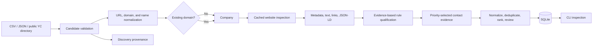

# GEO Research Outreach Agent

A small, standalone Python application for discovering and qualifying potential partners for Generative Engine Optimization (GEO) research. It is deliberately separate from the existing GEO audit/experiment platform: it neither imports that platform nor integrates with it.

## MVP scope

Phase 1 imports safe local CSV/JSON demo data. Phase 2A adds bounded YC discovery and website evidence. Phase 2B adds a public local-chamber source, separates eligibility/opportunity/priority/confidence, and provides ranking plus independent human review. Phase 3 adds conservative first-party contact evidence, normalization, contextual role ranking, validation, and an independent contact-review queue. There is still no message generation, provider integration, or sending behavior.



SQLite is the internal source of truth. Google Sheets may later become a human-facing operational interface, but is intentionally absent now.

## Architecture decisions

- `Company` owns research suitability state: `DISCOVERED`, `QUALIFIED`, `NEEDS_REVIEW`, `REJECTED`, or eventually `READY_FOR_GEO`.
- Company lifecycle changes use an explicit allowed-transition map; terminal handoff cannot silently move backward.
- `Outreach` has a separate lifecycle (`DRAFT` through `SENT`/`FAILED`/`CANCELLED`). A qualified company is not the same thing as a sent message.
- One company is identified primarily by a normalized domain. Multiple `DiscoveryRecord` rows retain distinct source identifiers without duplicating the company.
- A repeated import is idempotent for both companies and identical provenance. Database uniqueness constraints backstop application checks.
- Qualification is explainable and configured in `config/qualification.yaml`; these are provisional research heuristics, not scientific conclusions.
- Eligibility, GEO opportunity, outreach priority, and evidence confidence are distinct machine outputs. Missing evidence becomes `UNKNOWN`/`NEEDS_REVIEW`, never an assumed negative opportunity.
- Priority tiers use absolute YAML thresholds, never percentiles or forced distributions.
- Human review (`PENDING`, `APPROVED`, `REJECTED`, `MAYBE`) is independent and survives requalification.
- Raw industry labels are preserved alongside a deliberately small normalized taxonomy. Exact employee counts are stored only when a source reports them; otherwise size is `UNKNOWN`.
- Website evidence is stored separately as one `WebsiteSnapshot` with a few `WebsitePage` rows. Company rows remain compact.
- Public collection is sequential, identifies itself with a research User-Agent, checks robots rules, caps pages and response size, and records blocks/failures instead of bypassing them.
- Fresh snapshots are reused for the configured TTL (168 hours by default); `--refresh` is an explicit opt-in.
- Contact enrichment defaults to `HIGH` and `MEDIUM` priority companies and reads stored first-party website evidence. It records an explicit `CONTACT_NOT_FOUND` rather than guessing.
- A person is created only when the page explicitly associates a name, role, and public address. Generic published mailboxes remain `GENERIC_BUSINESS_CONTACT`; no address is generated from a name or domain.
- Role ranking is contextual: founder/owner leads for startups, marketing/digital/content leads for medium companies, and owner/general management leads for local SMBs.
- Sending does not exist. `SEND_MODE=dry_run` is a defensive default reserved for future work.

## Setup

Requires Python 3.12 or newer.

```bash
python3.12 -m venv .venv
source .venv/bin/activate
python -m pip install '.[dev]'
```

Configuration lives in `config/`. Environment variables may override `OUTREACH_DATABASE_URL`, `OUTREACH_LOG_LEVEL`, and `SEND_MODE`; copy `.env.example` as a reference, but note that `.env` loading is not automatic and secrets must not be committed.

## CLI and demo

The default database is `data/outreach.db`.

```bash
python -m outreach_agent init-db
python -m outreach_agent discover --source data/demo_companies.csv
python -m outreach_agent discover --source data/demo_companies.json
python -m outreach_agent discover-real --limit 25
python -m outreach_agent discover-chamber --limit 40
python -m outreach_agent inspect-websites --limit 25
python -m outreach_agent website-evidence 1
python -m outreach_agent qualify
python -m outreach_agent qualify --requalify
python -m outreach_agent enrich-contacts --priority HIGH,MEDIUM --limit 25
python -m outreach_agent enrich-contacts --priority HIGH,MEDIUM --review APPROVED,MAYBE --limit 25
python -m outreach_agent contacts list --review PENDING
python -m outreach_agent contacts show 1
python -m outreach_agent contacts review-set 1 APPROVED --notes "Verified on first-party team page"
python -m outreach_agent candidates rank --limit 20 --review PENDING
python -m outreach_agent review set 1 MAYBE --notes "Professor review needed"
python -m outreach_agent calibration-report
python -m outreach_agent export-review --output data/research_partner_review.csv
python -m outreach_agent import-review --source data/research_partner_review.csv
python -m outreach_agent companies list
python -m outreach_agent companies show 1
python -m outreach_agent status
```

Run discovery again to confirm idempotency: no new company or identical provenance rows will be created. Use `qualify --force` only when deliberately re-evaluating records after changing rules.

`discover-real` uses the public, static YC Consumer industry directory. It ignores inactive companies and companies reporting more than 250 people, caps a run at 50, and retains the YC company ID and detail URL as provenance. The selected static directory/detail paths were checked against YC's published robots rules; the disallowed query-driven directory route is not used.

`discover-chamber` reads public listing cards from the Greater Dalton Chamber GrowthZone directory. This source was selected to add local services, retailers, healthcare, finance, manufacturing, and nonprofit organizations rather than another internet-startup-only population. It reads business names, public websites, locations, and categories; it does not open email/contact endpoints. Its current robots policy permits the alphabetical listing routes.

`inspect-websites` checks `/robots.txt` before crawling, probes `/sitemap.xml` conservatively, fetches the homepage, and follows at most the configured number of high-value same-domain links. It never recursively crawls a site. Use `--refresh` to deliberately replace fresh cache use with a new snapshot.

Collection settings in `config/settings.yaml` control timeout, one-second request delay, retry count, page/company caps, response-size cap, User-Agent, and cache TTL.

## Contact discovery and review

Run `inspect-websites` before `enrich-contacts`. Website inspection follows only a bounded set of same-domain high-value links, including contact, about, team, leadership, and staff pages, while honoring robots rules and caching. Contact enrichment then consumes the stored structured evidence; it does not require LinkedIn, logins, CAPTCHA bypasses, paid enrichment APIs, personal social profiles, leaked data, SMTP probing, or mailbox guessing.

Contacts use a compact role taxonomy: `FOUNDER_OWNER`, `EXECUTIVE`, `MARKETING_GROWTH`, `SEO_CONTENT`, `PARTNERSHIPS`, `BUSINESS_DEVELOPMENT`, `DIGITAL_ECOMMERCE`, `COMMUNICATIONS`, `GENERAL_BUSINESS`, `OTHER`, and `UNKNOWN`. Ranking reasons identify the company context and whether an explicit public email exists. Syntax validation means only that the published address is well formed; it is not a claim of deliverability.

Company review and contact review are intentionally independent. `contacts review-set` changes only the contact's `PENDING`/`APPROVED`/`REJECTED`/`MAYBE` decision and audit fields. Re-running enrichment is idempotent for an existing normalized email and leaves review decisions intact.

## Phase 3 live validation

The 28-company live validation audit, methodology, before/after metrics, and limitations are documented in [`docs/phase3_live_validation_audit.md`](docs/phase3_live_validation_audit.md). The frozen sample, original results, row-level manual judgments, and corrected rerun are stored in `data/phase3_validation_*.csv`. The audit found that generic-mailbox results can support a mandatory human-review queue, but named-contact coverage is not yet reliable enough for operational use.

## Qualification and review

Machine output contains:

- **Eligibility:** whether evidence supports a real, active, analyzable company.
- **GEO opportunity:** `HIGH`, `MEDIUM`, `LOW`, or `UNKNOWN`, based on combinations of content and observable gaps.
- **Priority:** an explainable 0–100 score and absolute `HIGH`, `MEDIUM`, `LOW`, or `NEEDS_REVIEW` tier.
- **Confidence:** evidence completeness/quality, not company quality.

`qualify --requalify` recomputes these machine fields while preserving website snapshots and every human-review field. `calibration-report` shows distributions by source and normalized industry.

The CSV review surface is intentionally spreadsheet-friendly. It can be uploaded to Google Sheets without credentials. On import, only `review_status`, `review_notes`, and `reviewed_by` are accepted; edits to names, websites, scores, and other canonical columns are ignored. SQLite remains the source of truth. Direct Google API sync is deferred until credentials and the desired operational sheet are available.

Run tests with:

```bash
pytest
```

## Repository layout

```text
config/                 YAML settings, source examples, qualification rules
data/                   safe fictional demo inputs; runtime DB is ignored
src/outreach_agent/     models, discovery, website evidence, qualification, CLI
tests/                  unit and integration tests
```

## Safety guarantees

- There is no email-sending implementation or provider dependency.
- Demo domains use the reserved `.example` namespace.
- No paid APIs, social-platform scraping, LinkedIn dependency, private-data source, or GEO-platform integration exists.
- Real-company discovery and website inspection only read ordinary public pages; blocks and robots restrictions are honored.
- Future production sending must require explicit human approval; test sending should require a recipient allowlist.

## Intentionally deferred

Additional discovery sources, JavaScript rendering, mailbox deliverability checks, Google Sheets/Forms, templates, human approval UI, Gmail/provider integration, response tracking, and GEO handoff are future phases. A small additive schema upgrader supports existing Phase 1/2 databases, but a formal migration tool will be needed once the model evolves further.

## Suggested next phase

Have the professor label a sample of stored snapshots, then calibrate the provisional weights/thresholds and add an inspection export for human review. Keep outreach sending deferred until review, approval, allowlisting, and audit controls are designed and tested.
