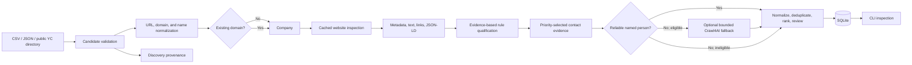

# GEO Research Outreach Agent

A small, standalone Python application for discovering and qualifying potential partners for Generative Engine Optimization (GEO) research. It is deliberately separate from the existing GEO audit/experiment platform: it neither imports that platform nor integrates with it.

## MVP scope

Phase 1 imports safe local CSV/JSON demo data. Phase 2A adds bounded YC discovery and website evidence. Phase 2B adds a public local-chamber source, separates eligibility/opportunity/priority/confidence, and provides ranking plus independent human review. Phase 3 and 3B add first-party contact extraction with an optional selective Crawl4AI fallback. Phase 3C ranks official business channels, including published business emails and contact forms, for mandatory human review. Phase 5A adds provider-free draft generation and a local-only simulated workflow; it does not add real message delivery or form submission.



SQLite is the internal source of truth. Google Sheets may later become a human-facing operational interface, but is intentionally absent now.

## Architecture decisions

- `Company` owns research suitability state: `DISCOVERED`, `QUALIFIED`, `NEEDS_REVIEW`, `REJECTED`, or eventually `READY_FOR_GEO`.
- Company lifecycle changes use an explicit allowed-transition map; terminal handoff cannot silently move backward.
- `Outreach` has a separate lifecycle (`DRAFT` through `SENT`/`FAILED`/`CANCELLED`). A qualified company is not the same thing as a sent message.
- One company is identified primarily by a normalized domain. Multiple `DiscoveryRecord` rows retain distinct source identifiers without duplicating the company.
- A repeated import is idempotent for both companies and identical provenance. Database uniqueness constraints backstop application checks.
- Qualification is explainable and configured in `config/qualification.yaml`; these are provisional research heuristics, not scientific conclusions.
- Eligibility, GEO opportunity, outreach priority, and evidence confidence are distinct machine outputs. Missing evidence becomes `UNKNOWN`/`NEEDS_REVIEW`, never an assumed negative opportunity.
- Priority tiers use absolute YAML thresholds, never percentiles or forced distributions.
- Human review (`PENDING`, `APPROVED`, `REJECTED`, `MAYBE`) is independent and survives requalification.
- Raw industry labels are preserved alongside a deliberately small normalized taxonomy. Exact employee counts are stored only when a source reports them; otherwise size is `UNKNOWN`.
- Website evidence is stored separately as one `WebsiteSnapshot` with a few `WebsitePage` rows. Company rows remain compact.
- Public collection is sequential, identifies itself with a research User-Agent, checks robots rules, caps pages and response size, and records blocks/failures instead of bypassing them.
- Fresh snapshots are reused for the configured TTL (168 hours by default); `--refresh` is an explicit opt-in.
- Contact enrichment defaults to `HIGH` and `MEDIUM` priority companies and reads stored first-party website evidence. It records explicit contactability and channel outcomes rather than guessing.
- A person is created only when first-party evidence explicitly associates a plausible name with a relevant role; an email is optional. Generic published mailboxes remain separate `GENERIC_BUSINESS_CONTACT` records, and no address is generated from a name or domain.
- The same `enrich-contacts` run extracts business channels from the fetched HTML: partnership, business-development, general-business, named-person, sales/marketing, support, restricted email, and official contact form. It recommends one suitable primary channel and preserves alternatives. Unsuitable support/restricted channels remain visible for review but are never recommended.
- Role ranking is contextual: founder/owner leads for startups, marketing/digital/content leads for medium companies, and owner/general management leads for local SMBs.
- Phase 5A has no real sending adapter. The offline `DemoTransport` has no network code path; the real-delivery gate stays blocked even when every future approval/configuration flag is true.

## Setup

Requires Python 3.12 or newer.

```bash
python3.12 -m venv .venv
source .venv/bin/activate
python -m pip install '.[dev]'
```

Configuration lives in `config/`. Environment variables may override `OUTREACH_DATABASE_URL`, `OUTREACH_LOG_LEVEL`, and `SEND_MODE`; copy `.env.example` as a reference, but note that `.env` loading is not automatic and secrets must not be committed.

## CLI and demo

The default database is `data/outreach.db`.

```bash
python -m outreach_agent init-db
python -m outreach_agent discover --source data/demo_companies.csv
python -m outreach_agent discover --source data/demo_companies.json
python -m outreach_agent discover-real --limit 25
python -m outreach_agent discover-chamber --limit 40
python -m outreach_agent inspect-websites --limit 25
python -m outreach_agent website-evidence 1
python -m outreach_agent qualify
python -m outreach_agent qualify --requalify
python -m outreach_agent enrich-contacts --priority HIGH,MEDIUM --limit 25
python -m outreach_agent enrich-contacts --priority HIGH,MEDIUM --review APPROVED,MAYBE --limit 25
python -m outreach_agent contacts list --review PENDING
python -m outreach_agent contacts show 1
python -m outreach_agent contacts review-set 1 APPROVED --notes "Verified on first-party team page"
python -m outreach_agent candidates rank --limit 20 --review PENDING
python -m outreach_agent review set 1 MAYBE --notes "Professor review needed"
python -m outreach_agent calibration-report
python -m outreach_agent export-review --output data/research_partner_review.csv
python -m outreach_agent import-review --source data/research_partner_review.csv
python -m outreach_agent export-company-selection --output data/company_selection_review.csv --summary data/company_selection_summary.csv
python -m outreach_agent review override-channel 1 12 --reason "Official partnership page is the best fit"
python -m outreach_agent companies list
python -m outreach_agent companies show 1
python -m outreach_agent status
```

Run discovery again to confirm idempotency: no new company or identical provenance rows will be created. Use `qualify --force` only when deliberately re-evaluating records after changing rules.

`discover-real` defaults to the official, public static YC Consumer industry directory and accepts another static category URL with `--directory-url`. It ignores inactive companies and companies reporting more than 250 people, caps a run at 50, and retains the YC company ID/profile URL and directory route as provenance. Static routes are checked against `robots.txt` fail-closed; the disallowed query-driven directory route is not used.

`discover-chamber` reads public listing cards from the Greater Dalton Chamber GrowthZone directory. This source was selected to add local services, retailers, healthcare, finance, manufacturing, and nonprofit organizations rather than another internet-startup-only population. It reads business names, public websites, locations, and categories; it does not open email/contact endpoints. Its current robots policy permits the alphabetical listing routes.

`inspect-websites` checks `/robots.txt` before crawling, probes `/sitemap.xml` conservatively, fetches the homepage, and follows at most the configured number of high-value same-domain links. It never recursively crawls a site. Use `--refresh` to deliberately replace fresh cache use with a new snapshot.

Collection settings in `config/settings.yaml` control timeout, one-second request delay, retry count, page/company caps, response-size cap, User-Agent, and cache TTL.

## Contact discovery and review

Run `inspect-websites` before `enrich-contacts`. Website inspection follows only a bounded set of same-domain high-value links, including contact, about, team, leadership, and staff pages, while honoring robots rules and caching. Contact enrichment then consumes the stored structured evidence; it does not require LinkedIn, logins, CAPTCHA bypasses, paid enrichment APIs, personal social profiles, leaked data, SMTP probing, or mailbox guessing.

Contacts use a compact role taxonomy: `FOUNDER_OWNER`, `EXECUTIVE`, `MARKETING_GROWTH`, `SEO_CONTENT`, `PARTNERSHIPS`, `BUSINESS_DEVELOPMENT`, `DIGITAL_ECOMMERCE`, `COMMUNICATIONS`, `GENERAL_BUSINESS`, `OTHER`, and `UNKNOWN`. Ranking reasons identify the company context and whether an explicit public email exists. Syntax validation means only that the published address is well formed; it is not a claim of deliverability.

Company review and contact review are intentionally independent. `contacts review-set` changes only the contact's `PENDING`/`APPROVED`/`REJECTED`/`MAYBE` decision and audit fields. Re-running enrichment is idempotent for an existing normalized email or form URL and leaves review decisions intact. `READY_FOR_REVIEW` means a public first-party channel was found; it does not mean approval to contact.

The unified `export-company-selection` view joins qualification, evidence confidence, explainable GEO opportunity/priority, website status, contact route, and independent company/channel decisions into one spreadsheet-compatible row per stable company ID. Missing size, geography, or industry is shown as missing and is not an exclusion. GEO opportunity is an inference from public content and site structure, not a measurement of ChatGPT or other AI search visibility. Reviewers can approve/reject/mark a company `MAYBE` using `review set`; channel decisions remain on the contact using `contacts review-set`. `review override-channel` records a different same-company suitable channel plus a required explanation without changing the machine-selected channel. None of these actions sends or submits anything. The unified CSV can be imported through the existing `import-review` command; only company/channel review fields and documented channel overrides are applied, while canonical machine fields are ignored.

Contact extraction is one unified pipeline. The stored HTML evidence is examined first with lightweight, deterministic rules that preserve team-card, heading/role, and founder-biography relationships. When a HIGH/MEDIUM-priority company still has no defensible named person and a previously fetched first-party About/Team/Leadership page contains leadership signals, the same `enrich-contacts` command can selectively render at most two approved URLs with Crawl4AI. Both paths use the same `Contact`, normalization, ranking, email validation, provenance, and human-review workflow; Crawl4AI is an optional internal library, not a service or second agent.

The normal HTTP-only installation remains the default:

```bash
uv sync --extra dev
python -m outreach_agent enrich-contacts --priority HIGH,MEDIUM --limit 25
```

Install and explicitly enable the optional fallback when browser rendering is wanted:

```bash
uv sync --extra dev --extra crawl4ai
python -m crawl4ai install
python -m outreach_agent enrich-contacts --priority HIGH --limit 10 --crawl4ai-fallback
```

`contact_extraction.crawl4ai_fallback` in `config/settings.yaml` controls enablement, page/company caps, timeout, and cache policy. It is disabled by default because Crawl4AI adds roughly 95 packages and browser assets. The adapter uses Crawl4AI's cache, reuses one browser session across a company's bounded pages, remains sequential, honors robots checks, and does not use stealth or anti-bot bypasses. Package absence, launch failure, timeout, navigation failure, and empty results are recorded in `contact_extraction_runs`; they do not turn a successful HTTP collection into a fetch failure or stop the job. Existing HTTP email evidence is retained and generic mailboxes remain separate from named people.

## Phase 3 live validation

The 28-company live validation audit, methodology, before/after metrics, and limitations are documented in [`docs/phase3_live_validation_audit.md`](docs/phase3_live_validation_audit.md). The frozen sample, original results, row-level manual judgments, and corrected rerun are stored in `data/phase3_validation_*.csv`. The audit found that generic-mailbox results can support a mandatory human-review queue, but named-contact coverage is not yet reliable enough for operational use.

Phase 3C's 28-company sample and 77-company dataset reports are documented in [`docs/phase3c_business_channel_validation.md`](docs/phase3c_business_channel_validation.md). Channel-level exports and representative manual checks are stored in `data/phase3c_validation_*.csv`.

Phase 3D's fixed 77-company unified selection review is documented in [`docs/phase3d_company_selection_validation.md`](docs/phase3d_company_selection_validation.md); the consolidated review queue and count summary are in `data/phase3d_company_review_77.csv` and `data/phase3d_company_selection_summary.csv`.

Phase 4A's discovery-source audit and expansion decision are documented in [`docs/phase4a_discovery_expansion.md`](docs/phase4a_discovery_expansion.md). The cohort remains at 77: candidate public directories were excluded where their terms prohibit automation, and official open business registries without company website fields were not converted into company records. The existing 77-company artifacts remain unchanged.

Phase 4A.1's isolated Los Angeles Open Data website-matching pilot is documented in [`docs/phase4a1_open_dataset_pilot.md`](docs/phase4a1_open_dataset_pilot.md); its 30-row evidence log is [`data/phase4a1_website_matching_pilot.csv`](data/phase4a1_website_matching_pilot.csv). Three first-party matches were verified, and none were imported into the canonical database.

Phase 4B evaluated the YC OSS company JSON dataset. Its source schema and provenance are promising, but the dataset repository declares no license for the redistributed company records; no bulk download or ingestion was performed pending permission clarification. See [`docs/phase4b_yc_oss_dataset_evaluation.md`](docs/phase4b_yc_oss_dataset_evaluation.md).

Phase 4C's Wikidata CC0 query pilot is documented in [`docs/phase4c_wikidata_discovery_validation.md`](docs/phase4c_wikidata_discovery_validation.md). WDQS answered a bounded query once but the result was not preserved and an exact rerun returned HTTP 502; no companies were imported. The Phase 4C cohort/review exports remain copies of the unchanged 77-company baseline. After the endpoint recovers, the bounded evidence script can be rerun with `PYTHONPATH=src uv run python scripts/phase4c_wikidata_pilot.py`; review the pilot and verify websites before any import.

Phase 4C.1 fixed this workflow and completed a saved 30-company live pilot; see [`docs/phase4c1_wikidata_retrieval_validation.md`](docs/phase4c1_wikidata_retrieval_validation.md). Successful raw responses are stored under `data/phase4c1_wikidata_snapshots/`.

Resume safely after an interruption:

```sh
PYTHONPATH=src uv run python scripts/phase4c_wikidata_pilot.py --resume --target 30 --batch-size 20
```

Replay saved snapshots without network:

```sh
PYTHONPATH=src uv run python scripts/phase4c_wikidata_pilot.py --offline --target 30 --batch-size 20
```

The live retrieval command is the same without `--resume`. Website evidence and the generated pilot are under `data/phase4c1_*.csv`. No Phase 3 database was changed.

Phase 4C.2's offline quality audit and row-level evidence are documented in [`docs/phase4c2_wikidata_quality_analysis.md`](docs/phase4c2_wikidata_quality_analysis.md), with exports in `data/phase4c2_company_quality_audit.csv` and `data/phase4c2_filter_comparison.csv`. Rebuild them without network access from the saved Phase 4C.1 snapshots:

```sh
PYTHONPATH=src uv run python scripts/phase4c2_wikidata_quality.py
```

Recommendation: **do not use Wikidata for automated SMB discovery**. Keep it, at most, as a manually reviewed secondary lead source: the 30-company QID-order cohort has only 5 conservatively verified website identities, 24 lack employee counts, and no record has sourced evidence supporting SMB size. No live comparison query was run because available filters did not offer a defensible route to improve SMB quality.

Phase 4D expanded the two existing sources in an isolated copy to 198 unique companies (111 new YC directory records and 10 new Greater Dalton Chamber records); see [`docs/phase4d_existing_source_expansion.md`](docs/phase4d_existing_source_expansion.md). Phase 4E then checked all 121 additions using the existing bounded crawler and first-party identity evidence, and applied the existing qualification rules only to verified identities. Results and the contact sample are documented in [`docs/phase4e_expanded_cohort_validation.md`](docs/phase4e_expanded_cohort_validation.md). The frozen 77-company database remains unchanged; all 121 additions remain pending human review. Website verification, qualification, and unified review exports are `data/phase4e_website_verification.csv`, `data/phase4e_qualification_results.csv`, and `data/phase4e_expanded_company_review.csv`.

Reproduce Phase 4E against the isolated Phase 4D database (the script resumes from fresh snapshots and only targets the 121 additions):

```sh
OUTREACH_DATABASE_URL=sqlite:///data/phase4d_experimental.db PYTHONPATH=src uv run python scripts/phase4e_verify_expansion.py --batch-size 25 --contact-sample-limit 10
```

To skip bounded contact-channel extraction, add `--no-contact-sample`. Contact extraction is capped at 10 verified HIGH-priority additions and Crawl4AI fallback is disabled. Rebuild the unified review CSV from the experimental database with:

```sh
OUTREACH_DATABASE_URL=sqlite:///data/phase4d_experimental.db PYTHONPATH=src uv run python -m outreach_agent export-review --output data/phase4e_expanded_company_review.csv
```

Phase 4F copied the experimental database again and expanded it to 537 unique companies using nine official, robots-allowed static YC category routes plus three bounded Greater Dalton Chamber category routes. The workflow stopped after reaching the approximate target; it did not crawl all possible categories or infer a source-wide total. It verified and qualified only new additions in batches, resumed from category checkpoints and cached website snapshots, and contact-enriched at most ten verified HIGH-priority additions. All new additions remain pending human review. See [`docs/phase4f_500_company_scale_validation.md`](docs/phase4f_500_company_scale_validation.md) and the exports `data/phase4f_expanded_cohort.csv`, `data/phase4f_website_verification.csv`, `data/phase4f_qualification_results.csv`, and `data/phase4f_review_queue.csv`.

Create the Phase 4F copy once (do not overwrite an existing copy), run bounded discovery, then run resumable verification/qualification:

```sh
test ! -e data/phase4f_experimental.db && cp -p data/phase4d_experimental.db data/phase4f_experimental.db
OUTREACH_DATABASE_URL=sqlite:///data/phase4f_experimental.db PYTHONPATH=src uv run python scripts/phase4f_scale_cohort.py discover --target 500 --category-limit 50 --delay-seconds 1
OUTREACH_DATABASE_URL=sqlite:///data/phase4f_experimental.db PYTHONPATH=src uv run python scripts/phase4f_scale_cohort.py discover-chamber --category-limit 60 --delay-seconds 1
OUTREACH_DATABASE_URL=sqlite:///data/phase4f_experimental.db PYTHONPATH=src uv run python scripts/phase4f_scale_cohort.py process --batch-size 25 --contact-limit 10
```

The category checkpoint is `data/phase4f_discovery_checkpoint.json`; website snapshots are cached in the isolated database. Add `--no-contacts` to the `process` command to skip the bounded contact sample.

## Phase 4G human review and scale readiness

Phase 4G builds a read-only, deterministically ordered review queue from the 537-company Phase 4F database. It preserves the existing company/contact review fields and separates identity, eligibility, GEO, contact-channel, and outreach-approval states. Machine findings are not marked human-approved; outreach remains explicitly unapproved. The master queue has one row per stable company ID. Companion filtered views cover high-priority company review, unresolved known website identities, missing qualification evidence, and contact-channel review. The 77 legacy baseline companies are listed separately as identity-not-rechecked rather than being labeled ambiguous. See [`docs/phase4g_review_and_scale_readiness.md`](docs/phase4g_review_and_scale_readiness.md) for measured counts, source-diversity findings, and projection assumptions.

Generate or reproduce the exports offline (no crawl, discovery, or database writes):

```sh
PYTHONPATH=src uv run python scripts/phase4g_review_readiness.py
```

The script writes `data/phase4g_review_queue.csv`, filtered review views (`phase4g_high_priority_company_review.csv`, `phase4g_ambiguous_identity_review.csv`, `phase4g_missing_qualification_evidence.csv`, `phase4g_contact_channel_review.csv`, and `phase4g_legacy_identity_unassessed.csv`), plus source diversity and scale projections. Request counters, retry counts, cache hits, per-company elapsed time, and batch elapsed time are emitted by future bounded website runs; collecting them does not require changing or recrawling this saved cohort. Current scale estimates use the Phase 4F measured first-pass and cached-replay runtimes and explicitly label the historical request count as a lower bound.

The integrated Phase 3B rerun is documented in [`docs/phase3b_live_validation.md`](docs/phase3b_live_validation.md). It recovered 11 manually verified named contacts while retaining all 12 public mailbox records, and invoked the fallback for only 8 of 28 companies.

## Phase 5A/5C professor demo — offline only

The sender account is intentionally not selected. `config/outreach.yaml` keeps sender name/email, reply-to, Participation Interest Form URL, research contact, researcher, team, and university affiliation unset, with live delivery disabled. Email drafts direct interest to the Participation Interest Form; email is listed only for research questions. Demo drafts use a clearly labeled reserved `.invalid` URL. No Gmail, Microsoft 365, SMTP, API key, browser automation, or form-submit integration is required or present. The demo reads the existing 537-company Phase 4F database read-only, combines its stored qualifications/contact evidence with saved website-verification exports, and writes labeled draft/simulation CSVs. It does not modify approval fields or the database, send email, submit forms, or establish consent. The simulated participation workflow distinguishes a form-interest indication from formal research consent.

Run the deterministic walkthrough from the repository root:

```sh
PYTHONPATH=src uv run python scripts/phase5a_outreach_demo.py demo --max-draft-companies 10
```

Expected summary: `cohort=537 draft_companies=10 email_drafts=9 form_drafts=1`; `simulated_deliveries=1 simulated_interested_responses=1 simulated_signup_handoffs=1`; and `real_sends=0 form_submissions=0 sender_configured=False`. The named examples are Vexo (saved business-email evidence), AnswerThis (saved first-party contact-form evidence), and CodeWisp (no usable channel). The run produces `phase5a_outreach_candidates.csv`, `phase5a_email_drafts.csv`, `phase5a_contact_form_drafts.csv`, and `phase5a_delivery_simulation.csv` in `data/`. All are labeled with real-vs-simulated boundaries; drafts remain unapproved.

Phase 5A also provides a bounded, resumable offline contact extraction command that reuses the existing contact extractor against cached page evidence only. This command writes contact records/statuses into the Phase 4F experimental DB, not the frozen baseline; use it only when intentionally continuing the contact review pass:

```sh
PYTHONPATH=src uv run python scripts/phase5a_outreach_demo.py enrich-cache --limit 100 --batch-size 25
```

It is limited to 100 companies per invocation and batches of at most 25. It makes no network calls, disables Crawl4AI fallback, and preserves/checks existing human-review fields. Re-running resumes on remaining `NOT_RUN` companies. Real delivery remains a separately authorized future integration and is not part of Phase 5A. See [`docs/professor_demo_walkthrough.md`](docs/professor_demo_walkthrough.md) and [`docs/phase5a_outreach_pipeline_validation.md`](docs/phase5a_outreach_pipeline_validation.md).

## Phase 5B professor dashboard

Start the local dashboard with `uv run python scripts/phase5b_dashboard.py`, then open [http://127.0.0.1:8765](http://127.0.0.1:8765). It explores the actual 537-company experimental cohort and saved qualification/contact evidence. Phase 5D adds persistent DEMO-only campaign records in a separate ignored SQLite sidecar; the Phase 4F cohort remains read-only. There is no email provider, real-send route, public form endpoint, or company website request. See [`docs/phase5b_professor_dashboard.md`](docs/phase5b_professor_dashboard.md) and [`docs/phase5d_campaign_manager.md`](docs/phase5d_campaign_manager.md).

## Phase 5D campaign manager and reusable interest-form demo

Seed/resume the reproducible 20-company professor scenario and generate its two review CSV exports:

```sh
uv run python scripts/phase5d_campaign_demo.py seed --count 20
```

The scenario uses 20 actual verified/eligible cohort companies with suitable saved first-party channels: 19 email drafts and one contact-form draft held in a separate manual review queue. It records only explicitly synthetic DEMO deliveries, failures/retries, responses, one interest form, demo review, and follow-up handoff. Expected first-run summary shape: `companies=20 drafts=20 simulated_deliveries=19 simulated_failures=2 simulated_submissions=1 real_sends=0 real_form_submissions=0 formal_consents=0`. Start the dashboard with the Phase 5B command above to inspect campaigns, history, drafts, and analytics.

To re-export the unchanged sidecar state, run `uv run python scripts/phase5d_campaign_demo.py export`; exports are stable across repeated runs. The generated files are [`data/phase5d_demo_campaign_summary.csv`](data/phase5d_demo_campaign_summary.csv) and [`data/phase5d_demo_outreach_status.csv`](data/phase5d_demo_outreach_status.csv). To reset only one demo campaign, pass its printed ID to `uv run python scripts/phase5d_campaign_demo.py reset --campaign-id <campaign-id>`. This never resets company or human-review data. The dashboard uses only reserved `.invalid` demo URLs and all campaign/form states remain explicitly simulated. Sender, institution, study description, privacy notice, and real form settings remain unset. See [`docs/phase5d_professor_demo_walkthrough.md`](docs/phase5d_professor_demo_walkthrough.md) for a five-minute script and exact expectations.

## Qualification and review

Machine output contains:

- **Eligibility:** whether evidence supports a real, active, analyzable company.
- **GEO opportunity:** `HIGH`, `MEDIUM`, `LOW`, or `UNKNOWN`, based on combinations of content and observable gaps.
- **Priority:** an explainable 0–100 score and absolute `HIGH`, `MEDIUM`, `LOW`, or `NEEDS_REVIEW` tier.
- **Confidence:** evidence completeness/quality, not company quality.

`qualify --requalify` recomputes these machine fields while preserving website snapshots and every human-review field. `calibration-report` shows distributions by source and normalized industry.

The CSV review surface is intentionally spreadsheet-friendly. It can be uploaded to Google Sheets without credentials. On import, only `review_status`, `review_notes`, and `reviewed_by` are accepted; edits to names, websites, scores, and other canonical columns are ignored. SQLite remains the source of truth. Direct Google API sync is deferred until credentials and the desired operational sheet are available.

Run tests with:

```bash
pytest
```

## Repository layout

```text
config/                 YAML settings, source examples, qualification rules
data/                   safe fictional demo inputs; runtime DB is ignored
src/outreach_agent/     models, discovery, website evidence, qualification, CLI
tests/                  unit and integration tests
```

## Safety guarantees

- Phase 5A has no live email-sending implementation or provider dependency; demo delivery is local simulation only.
- Demo domains use the reserved `.example` namespace.
- No paid APIs, social-platform scraping, LinkedIn dependency, private-data source, or GEO-platform integration exists.
- Real-company discovery and website inspection only read ordinary public pages; blocks and robots restrictions are honored.
- Future production sending must require explicit human approval; test sending should require a recipient allowlist.

## Intentionally deferred

Additional discovery sources, mailbox deliverability checks, Google Sheets/Forms, automated form submission, Gmail/provider integration, real response tracking, and GEO handoff are future phases. Phase 5A's templates, local simulated state machine, and simulated response are demo-only. A small additive schema upgrader supports existing Phase 1/2 databases, but a formal migration tool will be needed once the model evolves further.

## Suggested next phase

Have the professor label a sample of stored snapshots, then calibrate the provisional weights/thresholds and add an inspection export for human review. Keep real delivery deferred until the sender is selected and a separately reviewed provider integration, explicit approvals, allowlisting, and audit controls are designed and tested.
